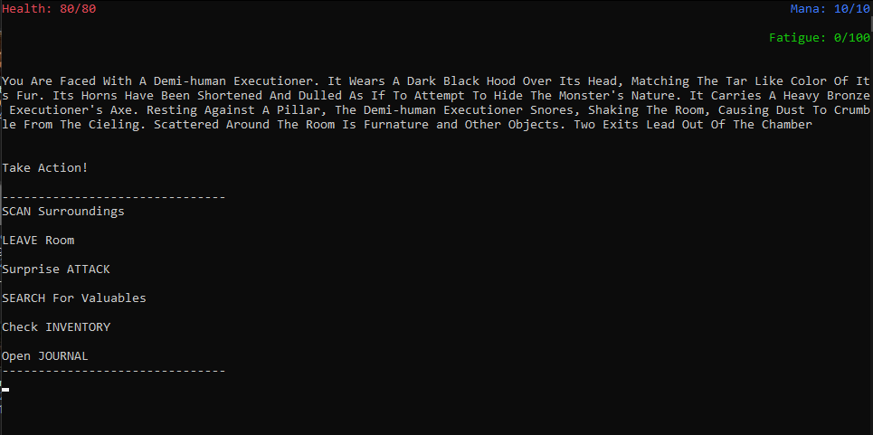
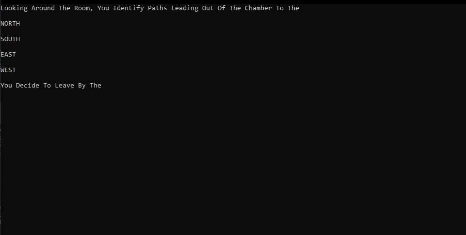
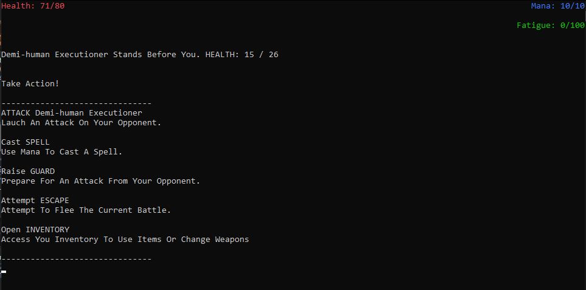
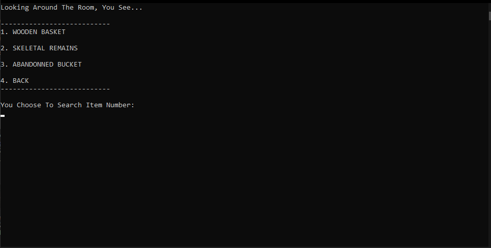

<h1>Depth Crawler</h1>

is a text based, dungeon crawler, action RPG with a simple looting and combat system as well as a fully realised story reliant on NPC dialogue and a quest system. This was a solo project developped over the span of two weeks in Visual Studio, parallel 
with another one of my projects, <a href="#">Death Delt Hand</a>. This game relies heavily on random procedural generation which allows for a different experience each and every playthrough. This randomness effects the map layout, enemy spawns, loot chances as well as other factors.

 

<h2>Gameplay</h2>

The main gameplay loop revolves around exploring the dungeon in order to find support items, complete quests and eventually reach the ending. To do this, the player is given access to Primary Actions. 

Primary Actions can be broken down into 4 main mechanics which come in the form of executeable actions that the player can choose between. These are:

<ul>
  <li>
Navigation
</li>
  <li>
Combat
</li>
  <li>
Looting
</li>
  <li>
Inventory
</li>
</ul>

  

<h3>Navigation</h3>

The "Leave Room" command is the navigation prompt which allows the player to move from chamber to chamber as they explore the dungeon. When prompted with the command *LEAVE*, the user will be presented with up to 4 directions to leave by (North, South, East, and West). The number of exits and the direction of each of these exits are randomized upon the room's creation. Each room will always have at minimum 2 exits and can never lead to a dead end. Additionally, returning from the entered direction of a room will lead back to the previously visited room, meaning that the player can accurately backtrack to rooms they have already explored should the need arise.

<a>Navigation Menu that will be presented to the player if they type the LEAVE prompt</a>
  

<h3>Combat</h3>

Combat is a focal point of gameplay as the player will encounter various foes as they travel through the dungeon's various chambers. Whenever the player enters a new chamber, there is a chance that they will partake in battle, whether this be by choice of the player or a forced confrontation by the enemy occupying the room. This is determined by the enemy's awareness, a predetermined state that is assigned to them when they spawn. This awareness can be one of three possibilities:

<ul>
  <li>
    <h4>Alert</h4>
    
An alert enemy will automatically force a confrontation upon entering its chamber. These enemies are not subseptible to surprise attacks

  </li>
  <li>
    <h4>Distracted</h4>
    
A distracted enemy will not force the player into a battle upon entering the room, however, they are easily alerted by actions such as looting or attempting to leave the chamber. These foes are subseptible to surprise attacks.

  </li>
  <li>
    <h4>Asleep</h4>
    
Sleeping foes are the least likely to notice a player when they enter the chamber and will not force combat unless alerted. Actions such as looting or attempting to leave the room are possible without alerting the enemy however, the longer a player remains in the chamber, the higher the chance that they wake the sleeping monster. While asleep, they are subseptible to surprise attacks.

  </li>
</ul>

Upon triggering a battle, the player will be locked into turn based combat with their opponent. In this situation, regular action prompts will be replaced with combat specific actions as seen bellow:

 

Combat is a game of probability determined by taking both the player and the monster's statistics and pitting them up against each other to determine the likelyhood of a succesful action. These statistics are:

<ul>
  <li>
    <h4>Hit Points</h4>
    
Hit Point or HP are the health of the associated entity. When this drops to zero, the entity will die. For the player, this results in a game over.

  </li>
  <li>
    <h4>Strength</h4>
    
Strength directly correlates to the damage that an entity can deal. Strength is also used in calculating the probability of a succesful guard break against a foe by mesuring against the opponents defense when attacking.

  </li>
  <li>
    <h4>Defense</h4>
    
Defense is first and foremost a value used in the calculation of damage negation. The higher the defense compared to the strength value of an incoming attack, the less damage that attack will do. Defense also determines the likelyhood of a succesful block against incoming attacks when guarding.

  </li>
  <li>
    <h4>Agility</h4>
    
Agility has two main functions in combat. The first is determining the likelyhood of an attack missing its intended target. The second function is for mid-fight escapes. In both cases, the agility of both fighters are mesured against each other. The fighter with the highest agility, is more likely to avoid attacks and succesfully escape.

  </li>
  <li>
    <h4>Accuracy</h4>
    
Finally, accuracy determines the probability of attacks hitting vital areas during combat, resulting in higher damage numbers. The higher the accuracy of an entity, the more likely they are to hit the torso of an opponent or even the head as supposed to the limbs which are more well guarded.

  </li>
  
</ul>

Combat can also be affected by entity specific statistics such as different monster types having unique weaknesses, resistances and even invulnerabilities as well as stat boosting special abilities. Examples of this include resistances to slashing damage from swords and axes or weaknesses to fire damage from spells which will increase or reduce damage from those sources. Some monsters are also invulnerable to status effects such as poison or stuns.

In the case of the player, base stats are altered during combat. Equipped weapons have their own individual stats that effect the player. For example, damage and guard effectiveness will add to player strength and defense while weigth will reduce agility. Most weapons are balanced such that they excel in some aspect while being weaker in others. For example, the battle hammer excels in damage and guarding ability but heavily reduces agility. By contrast, the flail has above average damage and slightly lower weigth at the cost of being a poor defensive choice.

Mana and fatigue levels also directly affect performance and must be managed in order to not suffer any drawbacks. Low mana will prevent spell casting which can be very powerful in a battle. Fatigue will heavily hinders combat ability if it gets too high as it will reduce agility, defense and strength accross the board.

  

<h4>Looting</h4>

Looting is another focal point of the experience and will be the main mechanic that allows the player to cheat death. Due to how prominent combat is, ressources such as mana, fatigue and even health can be expended rather quickly. Because of this, support items are a very powerful ressource that can be collected during a playthrough. These items can help replenish health and mana, deplete fatigue build up, cure ailements and even provide temporary stat boosts. While there are searcheable items in the environment, the player will have the option to search them to find various consumables so long as they arent in combat. Upon typing the *SEARCH* prompt, a looting menu will be displayed with a list of all places the player can search. This includes bookshelves, vases, skeletal remains, etc. Searcheable items are created along with the room they are in and can either reward the player with a consumable or yield nothing.

  

<h2>NPC Interactions</h2>

Upon entering a room, if an NPC is present, the player will be able to interact with them through a special menu. This menu is only available if an NPC is in the current room. These interactions can reveal information about the world the player finds themselves in, start a quest, progress the story, or even reward the player with an item or effect. NPC's can be spoken to multiple times which will unlock new dialogue. Additionally, as the story progresses, new characters will present themselves and existing ones will have their dialogue updated.

  

<h2>Procedural Generation</h2>

As explained above, the game heavily relies on procedural generation. This procedural generation affects the layout of the rooms and its contents. This ensures that no two playthroughs are the same, giving this game more replayability. The following is a list of all procedurally generated elements.

 
<h4>Rooms</h4>

There are three different types of rooms within the game files. These are the Dungeon Rooms, Loot Rooms and Quest Rooms. Upon entering a new chamber, the room will be generated based on one of these three templates. Which template the system chooses is completely random and only affected by the spawn chance of each room type, aside from one exception.

 
<h5>Dungeon Room</h5>

The Dungeon Room is the most common type of chamber to spawn and has the following conditions:

<ul>
  <li>Must Contain 1 Enemy</li>
  <li>May Contain Lootable Items</li>
  <li>Cannot Contain Any NPCs</li>
</ul>
