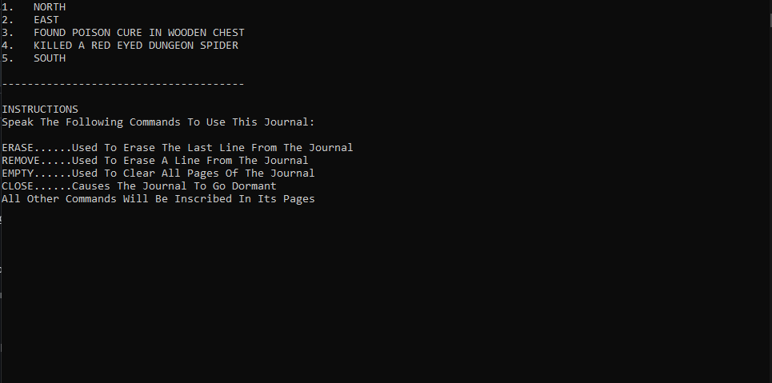

<h1>Depth Crawler</h1>

is a text based, dungeon crawler, action RPG with a simple looting and combat system as well as a fully realised story reliant on NPC dialogue and a quest system. This project takes a lot of inspiration from RPGs like Runescape and Dark Souls as well as a combat system similar to pokemon. This was a solo project developed over the span of two weeks in Visual Studio, in parallel with another one of my projects, <a href="https://github.com/LorenzoPicken/Death-Dealt-Hand/tree/Lorenzo's-Branch">Death Delt Hand</a>. This game relies heavily on random procedural generation which allows for a different experience each and every playthrough. This randomness effects the map layout, enemy spawns, loot chances as well as other factors.

 

<h2>Gameplay</h2>

The main gameplay loop revolves around exploring the dungeon in order to find support items, complete quests and eventually reach the ending. To do this, the player is given access to Primary Actions. 

Primary Actions can be broken down into 4 main mechanics which come in the form of executable actions that the player can choose between. These are:

<ul>
  <li>
Navigation
</li>
  <li>
Combat
</li>
  <li>
Looting
</li>
  <li>
Inventory
</li>
</ul>

  

<h3>Navigation</h3>

The "Leave Room" command is the navigation prompt which allows the player to move from chamber to chamber as they explore the dungeon. When prompted with the command *LEAVE*, the user will be presented with up to 4 directions to leave by (North, South, East, and West). The number of exits and the direction of each of these exits are randomised upon the room's creation. Each room will always have at minimum 2 exits and can never lead to a dead end. Additionally, returning from the entered direction of a room will lead back to the previously visited room, meaning that the player can accurately backtrack to rooms they have already explored should the need arise.

<a>Navigation Menu that will be presented to the player if they type the LEAVE prompt</a>
  

<h3>Combat</h3>

Combat is a focal point of gameplay as the player will encounter various foes as they travel through the dungeon's various chambers. Whenever the player enters a new chamber, there is a chance that they will partake in battle, whether this be by choice of the player or a forced confrontation by the enemy occupying the room. This is determined by the enemy's awareness, a predetermined state that is assigned to them when they spawn. This awareness can be one of three possibilities:

<ul>
  <li>
    <h4>Alert</h4>
    
An alert enemy will automatically force a confrontation upon entering its chamber. These enemies are not susceptible to surprise attacks

  </li>
  <li>
    <h4>Distracted</h4>
    
A distracted enemy will not force the player into a battle upon entering the room, however, they are easily alerted by actions such as looting or attempting to leave the chamber. These foes are susceptible to surprise attacks.

  </li>
  <li>
    <h4>Asleep</h4>
    
Sleeping foes are the least likely to notice a player when they enter the chamber and will not force combat unless alerted. Actions such as looting or attempting to leave the room are possible without alerting the enemy however, the longer a player remains in the chamber, the higher the chance that they wake the sleeping monster. While asleep, they are susceptible to surprise attacks.

  </li>
</ul>

Upon triggering a battle, the player will be locked into turn based combat with their opponent. In this situation, regular action prompts will be replaced with combat specific actions as seen below:

 

Combat is a game of probability determined by taking both the player and the monster's statistics and pitting them up against each other to determine the likelihood of a successful action. These statistics are:

<ul>
  <li>
    <h4>Hit Points</h4>
    
Hit Points or HP is the health of the associated entity. When this drops to zero, the entity will die. For the player, this results in a game over.

  </li>
  <li>
    <h4>Strength</h4>
    
Strength directly correlates to the damage that an entity can deal. Strength is also used in calculating the probability of a successful guard break against a foe by measuring against the opponents defence when attacking.

  </li>
  <li>
    <h4>Defense</h4>
    
Defence is first and foremost a value used in the calculation of damage negation. The higher the defence compared to the strength value of an incoming attack, the less damage that attack will do. Defence also determines the likelihood of a successful block against incoming attacks when guarding.

  </li>
  <li>
    <h4>Agility</h4>
    
Agility has two main functions in combat. The first is determining the likelihood of an attack missing its intended target. The second function is for mid-fight escapes. In both cases, the agility of both fighters are measured against each other. The fighter with the highest agility is more likely to avoid attacks and successfully escape.

  </li>
  <li>
    <h4>Accuracy</h4>
    
Finally, accuracy determines the probability of attacks hitting vital areas during combat, resulting in higher damage numbers. The higher the accuracy of an entity, the more likely they are to hit the torso of an opponent or even the head as opposed to the limbs which are more well guarded.

  </li>
  
</ul>

Combat can also be affected by entity specific statistics such as different monster types having unique weaknesses, resistances and even invulnerabilities as well as stat boosting special abilities. Examples of this include resistances to slashing damage from swords and axes or weaknesses to fire damage from spells which will increase or reduce damage from those sources. Some monsters are also invulnerable to status effects such as poison or stuns.

In the case of the player, base stats are altered during combat. Equipped weapons have their own individual stats that affect the player. For example, damage and guard effectiveness will add to player strength and defence while weight will reduce agility. Most weapons are balanced such that they excel in some aspects while being weaker in others. For example, the battle hammer excels in damage and guarding ability but heavily reduces agility. By contrast, the flail has above average damage and slightly lower weight at the cost of being a poor defensive choice.

Mana and fatigue levels also directly affect performance and must be managed in order to not suffer any drawbacks. Low mana will prevent spell casting which can be very powerful in a battle. Fatigue will heavily hinders combat ability if it gets too high as it will reduce agility, defence and strength across the board.

  

<h3>Looting</h3>

Looting is another focal point of the experience and will be the main mechanic that allows the player to cheat death. Due to how prominent combat is, resources such as mana, fatigue and even health can be expended rather quickly. Because of this, support items are a very powerful resource that can be collected during a playthrough. These items can help replenish health and mana, deplete fatigue build up, cure ailments and even provide temporary stat boosts. While there are searchable items in the environment, the player will have the option to search them to find various consumables so long as they aren't in combat. Upon typing the *SEARCH* prompt, a looting menu will be displayed with a list of all places the player can search. This includes bookshelves, vases, skeletal remains, etc. Searchable items are created along with the room they are in and can either reward the player with a consumable or yield nothing.

  

<h3>Inventory</h3>

The Inventory is where the player can gain access to their items and equipment and is divided into two sections. The first section is the holster and will allow the player to switch between weapons when needed. The second section is the backpack and is where all the consumables are held. Upon accessing the backpack, the player will be presented with a list of all items currently inside as well as the quantity of each item (Consumables can stack infinitely). By typing the name of the consumable then prompting the command *CONSUME*, the user will be presented with a confirmation message and the inventory will be adjusted. Following this, the effects of the consumable will be applied. The inventory can be accessed both during and outside of combat, however, switching weapons or using a consumable counts as a turn when in battle and will force the player back out of their inventory upon confirming an action.

  

<h3>Secondary Actions</h3>
<h4>The Journal</h4>

The journal is a magical book which will inscribe all commands spoken to it onto its pages. The main point of this feature is to get around the limitations of not possessing a visual map for the player to be able to keep track of their location. By inscribing their actions into the book, they can keep track of their movements and backtrack if the need arises.

  

<h2>NPC Interactions</h2>

Upon entering a room, if an NPC is present, the player will be able to interact with them through a special menu. This menu is only available if an NPC is in the current room. These interactions can reveal information about the world the player finds themselves in, start a quest, progress the story, or even reward the player with an item or effect. NPC's can be spoken to multiple times which will unlock new dialogue. Additionally, as the story progresses, new characters will present themselves and existing ones will have their dialogue updated.

  

<h2>Procedural Generation</h2>

As explained above, the game heavily relies on procedural generation. This procedural generation affects the layout of the rooms and their contents. This ensures that no two playthroughs are the same, giving this game more replayability. The following is a list of all procedurally generated elements.

 
<h3>Rooms</h3>

There are three different types of rooms within the game files. These are the Dungeon Rooms, Loot Rooms and Quest Rooms. Upon entering a new chamber, the room will be generated based on one of these three templates. Which template the system chooses is completely random and only affected by the spawn chance of each room type, aside from one exception.

 
<h4>Dungeon Room</h4>

The Dungeon Room is the most common type of chamber to spawn and has the following conditions:

<ul>
  <li>Must Contain 1 Enemy</li>
  <li>May Contain Lootable Items</li>
  <li>Cannot Contain Any NPCs</li>
</ul>

The bulk of the challenges that the player faces will take place within rooms of this type during combat. This is the only common room that will contain enemies.

 
<h4>Loot Room</h4>

Loot rooms are more rare than dungeon rooms but in exchange also have a much higher chance of spawning some consumables for the player to loot.

<ul>
  <li>Cannot Contain Enemies</li>
  <li>Must Contain Lootable Items (Higher Max Items Than Dungeon Rooms)</li>
  <li>Cannot Contain Any NPCs</li>
</ul>

The more loot rooms a player finds in their playthrough, the higher their chances of survival.

<h4>Quest Room</h4>

Quest Rooms are the rarest of all the possible rooms and trigger events that progress the story. These rooms contain NPCs, Cutscenes and Boss Fights

<ul>
  <li>Can Only Contain Boss Type Enemies</li>
  <li>Cannot Contain Lootable Items</li>
  <li>Must Contain NPCs or a Cutscene</li>
</ul>

Unlike the other rooms, Quest Rooms have a spawn gap of 3 to avoid potentially completing the story by accessing all the rooms back to back. Additionally, a quest room cannot spawn unless the player has reached the corresponding point in the story to access that room or completed the quest to unlock it.

  
<h3>Monsters</h3>

All monsters aside from Boss Monsters are procedurally generated with the room which randomises the species, subspecies and statistics. In the game, there are 6 types of basic monster species:

<ul>
  <li>Minotaurs</li>
  <li>Giant Spiders</li>
  <li>Gargoyles</li>
  <li>Bonedrikes</li>
  <li>Oculus Seekers</li>
  <li>Living Armour</li>
</ul>

Each one of these monsters has different behaviours and base stats from the others. This makes them fight very differently from one another. Additionally, all monsters have two special abilities unique to their species, for example, giant spiders have the ability to stun the player and poison them whereas minotaurs have a devastating heavy attack and a rage amp which can increase their strength. Subspecies are variations of the general species of a monster. This leads to two of the same monster having a different name, description and interaction text from one another. This is to help create variety within the 6 main monster types. This can be seen with the living armour which has three different variations. Finally, each monster species has particular base stats which are scaled up in relation to the player's current level. This is done by adding up all the player's stats, then the base monster's and then from here, a random number is rolled between 10 levels under the player's current level and 5 above. Then each stat is increased until the total level of the monster is equal to the random level chosen.

  

<h2>Incomplete And Missing Features</h2>

While I am happy with the state of the game as it is, there are some planned features that were never fully finalised or didn't end up making it into the game. This is mainly due to the short timeframe i had to work on this project as well as the fact that I was working on another game at the same time as this one. Here are the features in no particular order:

 
<h3>Saving System</h3>

One of the main complaints I got from play testers was the very difficult nature of the game. This is partially due to the checkpoint system never making it into the game. This system was supposed to save the player's progress upon progressing the story. This would allow the player to only restart a section of the game upon dying and also keep all their valuables they had collected. This would have also allowed the user to quit and come back instead of having to play through the entire game in a single playthrough. Additionally, the player would have been able to create multiple different characters and switch between them seamlessly from a main menu.

 

<h3>Level System</h3>

The original point of a monster scaling system was in order to continuously increase monster difficulty as the player progressed the story and increased their strength. Since there is no player levelling system in the current game, the monster scaler was changed to work off of the player's current level, instead of their progress in the story like it was originally supposed to. This was done since having the monsters continuously get stronger without allowing the player to do so as well made the game too difficult.

 

<h3>Expanded Weapon System</h3>

As it stands, the weapon system in the game is very basic and does not affect gameplay much. Aside from picking a starting armament at the beginning of the playthrough, the player never has to worry about their weapon again. In reality, these armaments were supposed to play a much greater role, allowing the player to make their own build and work hand in hand with the levelling system in a similar manner to Dark Souls or Elden Ring. Weapons also would have been able to be dual wielded or paired with other hand held items like shields. This can still be found in the code as each weapon has a value which specifies if they are one handed or two handed. Finally, the bow, which was a ranged weapon, was supposed to also be added and offer the unique ability to attack entities which might be out of range in exchange for offering no defensive benefits.

 

<h3>The Blacksmith and Resource Gathering</h3>

The Blacksmith is a character in the game named Ezikiel. In the current version, the player can choose to kill him in order to receive a very powerful sword, or help him and in exchange will receive a permanent mana boosting item toward the end of the game. Originally however, this character was supposed to play the role of a shopkeeper and weapon crafter. By bringing him back to the base camp and waiting for him to set himself up, the player would be able to trade resources for new gear or upgrade existing gear. These resources were supposed to come in the form of materials dropped by monsters upon killing them and old scrapped weapons that could be found by looting, just like consumables in the current game. The monster materials were also going to be unique to the creature's subspecies, adding an additional use to that mechanic aside from giving the illusion of more enemy variety. Weapon upgrades consisted of increasing a weapon's base stats like increasing damage, or defence or reducing weight. The materials needed for each upgrade would depend on the type of the weapon and the type of upgrade the player wanted to do. For example, to increase the damage of the dagger, the user would need to obtain a Razorclaw gargoyle nail.

 

<h3>Improved Combat System</h3>

The current combat system can feel very unfair and needs an overhaul. Enemies do too much damage, can be difficult to hit and often repeat actions too often. This was an issue I noticed during developpement but didn't have enough time to improve it with finalising the story taking priority at that time.

  

<h2>To Conclude...</h2>

A complete playthrough of Depth Crawler takes between 15 to 30 minutes and contains two different endings which are achieved based on the decisions that the player makes throughout the playthrough. While not all the features that were planned could be added, I am very satisfied with the outcome of the story and gameplay. I chose to end development on this project after the two weeks I was given were up as I enjoy the idea of having a small project like this to demonstrate my abilities to work under pressure and because I am happy with the overall current state of the game.

